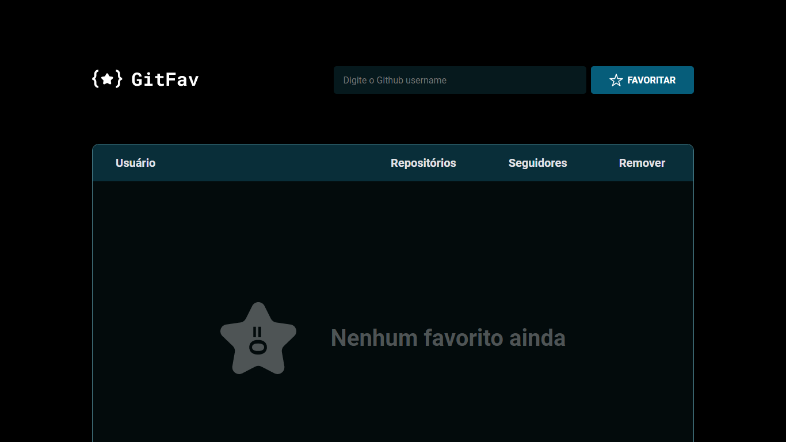
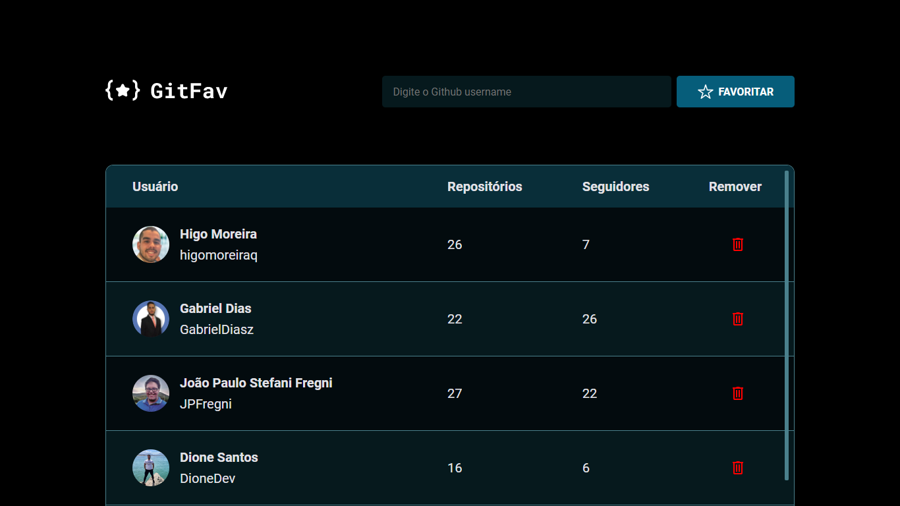

# git-fav ⭐️

Desafio 06 do Explorer da Rocketseat, cujo objetivo foi a criação de uma página de favoritos do GitHub, sendo possível adicionar ou remover favoritos, mostrando o usuário, a quantidade de repositórios e seguidores dos perfis favoritos.

A aplicação começa resetada, com a lista de usuários vazia, sendo informado na tela que não há nenhum favorito ainda.

Caso o usuário tente adicionar um perfil que não existe, receberá uma mensagem de alerta informando que o usuário não foi encontrado. Caso tente inserir um perfil repetido, receberá uma mensagem de alerta informando que o usuário já está cadastrado. Caso deseje remover um dos perfis favoritos, será solicitada a confirmação se deseja realmente excluir o usuário selecionado.

Página inicial sem nenhum perfil favorito:

Aplicação com perfis favoritos cadastrados:

